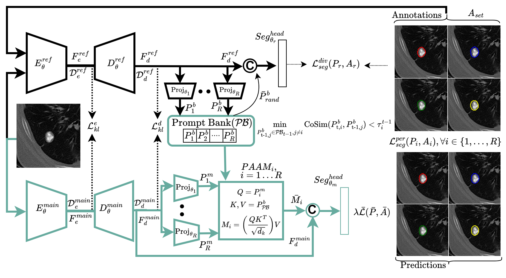

# ProPer: Prompt-aware Adaptive Personalization for Multi-rater Medical Image Segmentation



**Authors**: Md Motiur Rahman, Saeka Rahman, Smriti Bhatt, Miad Faezipour  

ProPer is a single-stage, end-to-end personalized segmentation framework for multi-rater medical images. It learns annotation diversity and rater-specific preferences through reference-guided supervision, a dynamic prompt-bank, and Prompt-Aware Attention Mapping (PAAM).

## Key Components

- **Reference-guided diversification**: a reference encoder-decoder receives the image plus all rater annotations and supervises the main image-only encoder-decoder.
- **Dynamic rater prompt-bank**: rater prompts are generated from reference-decoded features and updated with least-similar prompt replacement.
- **Prompt-Aware Attention Mapping (PAAM)**: rater-specific query prompts attend to the prompt-bank to produce personalized feature conditioning.
- **Shared segmentation head**: produces personalized rater outputs without maintaining a separate decoder for every rater.
- **Personalized, mean, and diversification losses**: supervise rater outputs, consensus behavior, and annotation diversity.

## Performance Highlights

| Dataset | Metric | ProPer |
| --- | --- | --- |
| LIDC-IDRI | Dice (%) | 91.90 |
| LIDC-IDRI | GED | 0.1289 |
| LIDC-IDRI | Soft Dice | 92.65 |
| RIGA | Dice (Disc, Cup) | 97.68, 86.86 |
| RIGA | ASSD (Disc, Cup) | 0.77, 4.02 |

## Repository Layout

```text
ProPer/
  proper/
    data/              CSV dataset loader for image and multi-rater masks
    models/            ProPer model, prompt-bank, PAAM, encoder-decoder blocks
    training/          Losses and metrics
    utils/             Reproducibility helpers
  configs/             LIDC-IDRI and RIGA example configs
  scripts/             Demo and training commands
  tests/               Forward and loss tests
```

## Installation

```bash
git clone https://github.com/Rahman-Motiur/ProPer.git
cd ProPer
python -m venv .venv
source .venv/bin/activate  # Windows: .venv\Scripts\activate
pip install -r requirements.txt
```

## Demo Forward Pass

```bash
python scripts/demo_proper_forward.py
```

## Training

Prepare a CSV file:

```csv
image,rater_1,rater_2,rater_3,rater_4
data/images/case_001.npy,data/masks/case_001_r1.npy,data/masks/case_001_r2.npy,data/masks/case_001_r3.npy,data/masks/case_001_r4.npy
```

Run:

```bash
python scripts/train_proper.py --config configs/proper_lidc_idri.yaml
```

## Datasets

The paper evaluates ProPer on:

- **LIDC-IDRI**: CT lung nodule segmentation with 4 raters.
- **RIGA**: fundus optic cup and disc segmentation with 6 raters.
- **QUBIQ**: additional multi-rater tasks for modality and rater generalization.

## Notes

During training, ProPer uses both reference and main pathways. During inference, only the image-only main pathway, prompt-bank, PAAM, and shared segmentation head are needed.

## Citation

```bibtex
@article{rahman2026proper,
  title={Prompt-aware Adaptive Personalization for Multi-rater Medical Image Segmentation},
  author={Rahman, Md Motiur and Rahman, Saeka and Shokouhmand, Shiva and Bhatt, Smriti and Faezipour, Miad},
  journal={Submitted},
  year={2026}
}
```
